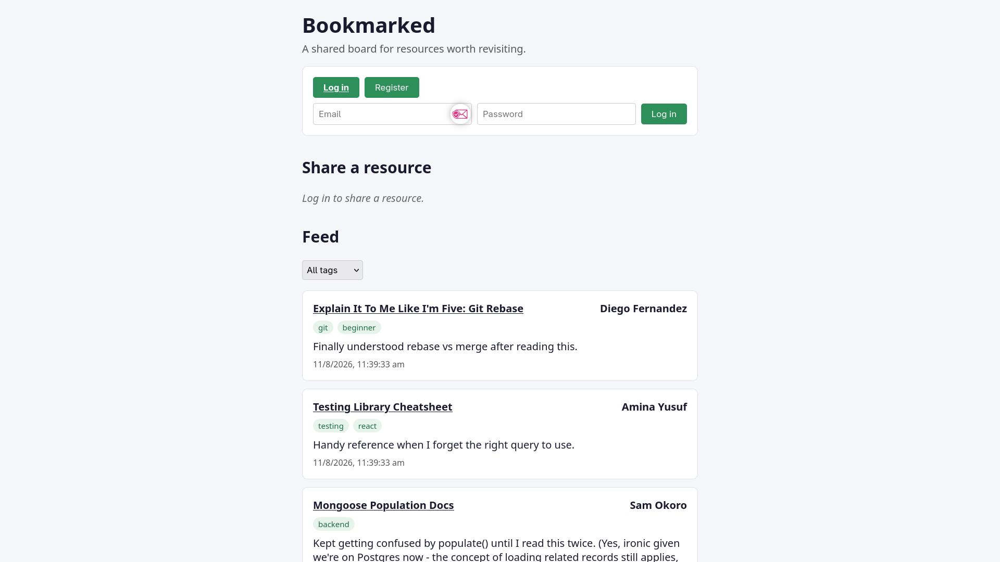
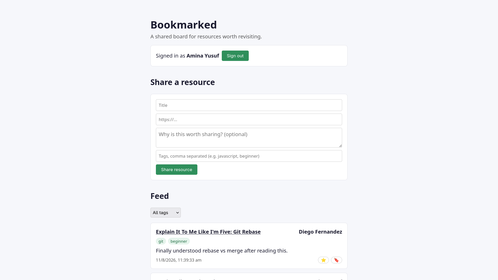
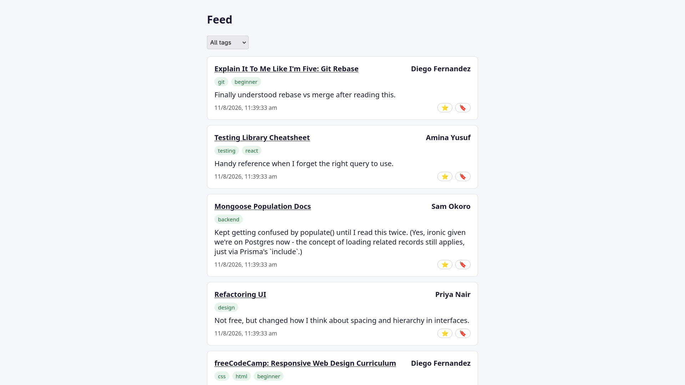

# Bookmarked

Bookmarked is a lightweight shared resource board. Cohort members post links
worth revisiting (articles, docs, tools, videos), tag them, react to ones
they found helpful, and browse the feed filtered by tag.

This repo is a sprint-phase project for the freeCodeCamp/NHCarrigan Summer
2026 Cohort. It's a real, runnable full-stack app - fork it, claim an issue,
and open a PR. See [CONTRIBUTING.md](./CONTRIBUTING.md) for the
issue-claiming workflow.

## Stack

- **Frontend**: Next.js (App Router), React, TypeScript, plain CSS
- **API**: Node.js + Express, Prisma, TypeScript
- **Database**: PostgreSQL
- **Auth**: JWT (email + password, bcrypt-hashed). This is intentionally
  simple for a sprint exercise - there's no email verification or password
  reset flow.
- **Tests**: Jest + Supertest + ts-jest (API), Jest + Testing Library (frontend)

This is the only fully TypeScript project among the sprint repos, and the
only one on a relational database via an ORM (Prisma) rather than an ODM -
if you want to practice SQL/relational modeling and migrations specifically,
this is the one.

## Quickstart

The fastest way to run the whole stack is Docker Compose:

```bash
cp .env.example .env
docker compose up --build
```

This starts three services:

- `db` - PostgreSQL on port `5433`
- `api` - Express API on [http://localhost:4100](http://localhost:4100)
- `web` - Next.js frontend on [http://localhost:3100](http://localhost:3100)

Once it's up, seed some demo data:

```bash
docker compose exec api npm run seed:compiled
```

(`seed:compiled` runs the already-built `dist/seed.js` - the Docker image is
production-only and doesn't include `ts-node`. If you're running the API
outside Docker with `npm run dev`, use `npm run seed` instead, which runs
the TypeScript source directly.)

Then open [http://localhost:3100](http://localhost:3100) and log in with one
of the seeded accounts (see `api/src/seed.ts` for emails - the password for
all of them is `password123`), or register your own account.

### Running without Docker

```bash
# API
cd api
cp .env.example .env
npm install
npx prisma migrate deploy   # applies the schema to the Postgres in .env
npm run seed
npm run dev

# Frontend (in a separate terminal)
cd web
cp .env.example .env
npm install
npm run dev
```

## API overview

| Method | Route                               | Auth required | Description                                                |
| ------ | ----------------------------------- | ------------- | ---------------------------------------------------------- |
| POST   | `/api/auth/register`                | no            | Create an account                                          |
| POST   | `/api/auth/login`                   | no            | Log in, get a JWT                                          |
| GET    | `/api/resources`                    | no            | List resources, optional `?tag=` / `?submittedBy=` filters |
| GET    | `/api/resources/:id`                | no            | Get a single resource                                      |
| POST   | `/api/resources`                    | yes           | Share a new resource                                       |
| POST   | `/api/resources/:id/reactions`      | yes           | Add an emoji reaction                                      |
| DELETE | `/api/resources/:id/reactions/:rid` | yes           | Remove your own reaction                                   |

The data model is intentionally shallow: a `User` has an email, display name,
and password hash. A `Resource` belongs to a submitting `User`, and has a
title, URL, description, and a Postgres native array of tags. A `Reaction`
is its own table with a foreign key to both `Resource` and `User`, with a
unique constraint on `(resourceId, userId, emoji)` to prevent duplicate
reactions - see [`prisma/schema.prisma`](./api/prisma/schema.prisma).

## Testing

```bash
# API tests (spins up a real, throwaway Postgres via embedded-postgres and
# applies the actual migration history to it - no external DB needed)
cd api
npm install
npm test

# Frontend tests
cd web
npm install
npm test
```

CI runs both suites on every push and pull request - see
[.github/workflows/ci.yml](./.github/workflows/ci.yml).

## Screenshots

**Login** : 


**Share a Resource :**


**Feed :**


## Contributing

See [CONTRIBUTING.md](./CONTRIBUTING.md) for how to claim an issue, the PR
workflow, and how to run tests locally before you submit.

## License

[MIT](./LICENSE)
