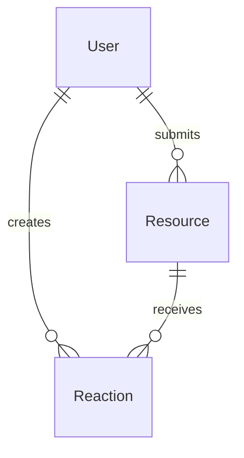
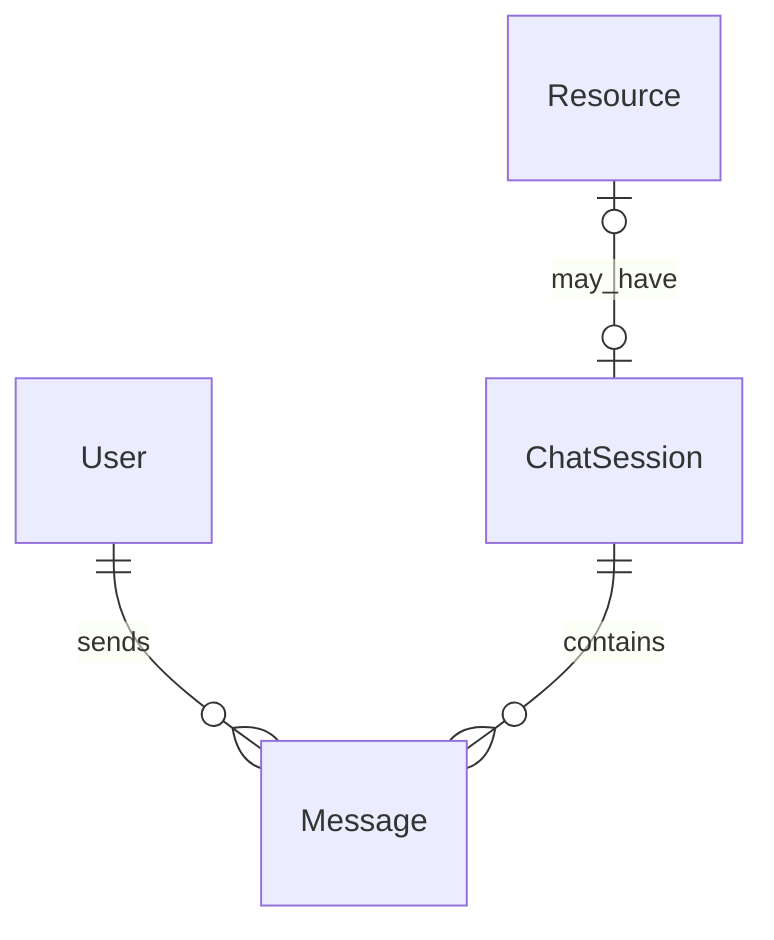

I’ll map the API’s request flow, persistence model, authentication boundaries, and test setup, then relate those pieces to where Socket.IO should fit. I’ll keep this mentor-focused: architecture, design decisions, implementation sequence, and pitfalls—not write the feature for you.

The core picture is clear: this is a small route-centric Express app, and Socket.IO is installed but not wired into the HTTP server or data model yet. I’ll inspect the API tests, type augmentation, seed data, and product documentation next so the guidance matches the repository’s conventions and intended chat behavior rather than imposing a generic architecture.

There is no chat/session specification in the checked-in code or README, so the critical unknown is the contribution issue’s acceptance criteria. I’ll identify the repository/issue context and inspect the current migration once, then I can separate what the codebase proves from what you should confirm with maintainers before designing events and tables.

# Backend orientation

This is a deliberately small Express API. It does not use controllers, services, repositories, dependency injection, or a large framework. Most behavior lives directly inside Express route handlers.

```text
HTTP request
    ↓
Express application middleware
    ↓
Router
    ↓
Optional JWT middleware
    ↓
Prisma query
    ↓
PostgreSQL
    ↓
JSON response
```

For chat, you’ll add a parallel real-time path:

```text
Socket.IO connection
    ↓
Socket authentication middleware
    ↓
Join a room/session
    ↓
Receive message event
    ↓
Validate and persist with Prisma
    ↓
Broadcast saved message to the room
```

## Folder structure

```text
api/
├── prisma/
│   ├── schema.prisma
│   └── migrations/
├── src/
│   ├── __tests__/
│   ├── middleware/
│   │   └── auth.ts
│   ├── routes/
│   │   ├── auth.ts
│   │   └── resources.ts
│   ├── types/
│   │   └── express.d.ts
│   ├── utils/
│   │   └── password.ts
│   ├── app.ts
│   ├── db.ts
│   ├── seed.ts
│   └── server.ts
├── Dockerfile
├── package.json
└── tsconfig.json
```

### `src/app.ts`: builds the Express application

`createApp()` constructs and configures Express:

1. Enables CORS.
2. Enables JSON body parsing.
3. Creates a rate limiter.
4. Registers `/api/health`.
5. Mounts auth and resource routers.
6. Adds the catch-all 404 handler.
7. Adds the final error handler.

The function returns the Express app without starting a network server. That separation is intentional because tests can do this:

```ts
const app = createApp();
request(app).get(...);
```

Supertest can test the application without binding port `4100`.

### `src/server.ts`: process entry point

This is the production/runtime bootstrap:

1. Loads environment variables.
2. Connects Prisma to PostgreSQL.
3. Calls `createApp()`.
4. Calls `app.listen()`.

This is where Socket.IO initially needs to enter the architecture.

Socket.IO does not attach directly to an Express `Application`. It attaches to the underlying Node HTTP server. Conceptually, `server.ts` will eventually do this:

```text
create Express app
        ↓
create Node HTTP server using the Express app
        ↓
attach Socket.IO to that HTTP server
        ↓
start HTTP server
```

Keep `createApp()` independent. Don’t initialize Socket.IO in `app.ts` unless you have a strong reason, because doing so would complicate the existing HTTP tests.

### `src/db.ts`: shared Prisma client

This exports one `PrismaClient` instance:

```ts
export const prisma = new PrismaClient();
```

Both HTTP handlers and Socket.IO handlers should reuse this instance. Do not create a new `PrismaClient` per socket, event, or request—doing that can exhaust the database connection pool.

### `src/routes/auth.ts`: registration and login

Authentication is conventional JWT authentication:

- Registration hashes a password and creates a `User`.
- Login compares the submitted password against `passwordHash`.
- Both routes sign a seven-day JWT.
- The token contains:
  - `sub`: user ID
  - `email`: user email

The response contains:

```json
{
  "token": "...",
  "user": {
    "id": "...",
    "email": "...",
    "displayName": "..."
  }
}
```

The password hash is deliberately excluded.

### `src/middleware/auth.ts`: HTTP authentication

Protected HTTP routes expect:

```http
Authorization: Bearer <jwt>
```

`requireAuth` verifies the JWT and writes the authenticated identity to:

```ts
req.user = {
  id: payload.sub,
  email: payload.email,
};
```

The Express type augmentation in `src/types/express.d.ts` makes `req.user` valid TypeScript.

Socket.IO cannot directly reuse `requireAuth` because it is Express middleware—it expects `Request`, `Response`, and `NextFunction`. A socket handshake has a different API.

However, you should reuse the underlying authentication logic. A good refactor would be:

```text
verify JWT token → return authenticated user identity
          ↑                         ↑
Express requireAuth       Socket.IO auth middleware
```

That avoids maintaining two subtly different JWT verification implementations.

### `src/routes/resources.ts`: the repository’s main style reference

This file shows the project’s conventions:

- One Express router per domain.
- Route comments document full paths.
- Validation occurs inside handlers.
- Prisma calls occur directly inside handlers.
- Successful results return JSON objects such as `{ resource }`.
- Errors return `{ error: "..." }`.
- Authentication is added route-by-route with `requireAuth`.

There is no separate service layer. For a small chat feature, you should not introduce five architectural layers just because larger applications sometimes do. A focused socket module plus perhaps a small shared chat service is enough.

## Current database model

`api/prisma/schema.prisma` has three models:



### `User`

Stores identity and credentials. Its `id` should become the sender foreign key for messages.

### `Resource`

Represents a shared link. A chat could potentially belong to a resource, but that is not established anywhere in the current repository.

### `Reaction`

Demonstrates useful relational conventions:

- Foreign keys to `User` and `Resource`.
- Cascading deletion when a resource is deleted.
- A database-level uniqueness rule.
- Relevant indexes.

For chat, use the database to enforce important relationships rather than trusting only application code.

---

# What is currently missing for chat

Socket.IO is installed in `api/package.json`, but it is not used yet.

There is currently:

- No Node HTTP server explicitly created.
- No Socket.IO server instance.
- No socket authentication.
- No event contract.
- No chat/session/message database model.
- No API for message history.
- No Socket.IO integration tests.
- No frontend Socket.IO client dependency or integration.

So you are starting the feature at its architectural boundary, not filling in an existing partial implementation.

## First: establish the feature requirements

“Chat session” can mean several different products:

1. One global chat room for all users.
2. One room per resource.
3. User-created chat sessions.
4. Direct messages between two users.
5. Temporary, non-persistent chat.
6. Persistent chat with history.

Before writing schema or event names, get answers to:

- Who can create a session?
- Who may join one?
- Is every authenticated user allowed?
- Is a session associated with a `Resource`?
- Are messages persisted after everyone disconnects?
- Is history paginated?
- Can messages be edited or deleted?
- Is typing status required?
- Is online presence required?
- What is the maximum message length?
- Should unauthenticated users read messages?
- Is this backend-only, or does the issue include frontend integration?

Do not infer these from “add Socket.IO.” Socket.IO is transport technology, not the product specification.

---

# Recommended architecture

For this repository, a reasonable addition would be:

```text
src/
├── sockets/
│   ├── index.ts
│   ├── auth.ts
│   └── chat.ts
├── routes/
│   └── chat.ts          # only if HTTP history/session routes are needed
└── types/
    └── socket.ts        # optional typed event contracts
```

You may not need every file immediately. Start small.

## Responsibility boundaries

### `server.ts`

Should:

- Connect to PostgreSQL.
- Create the Express app.
- Create the Node HTTP server.
- Initialize Socket.IO.
- Start listening.

It should not contain all chat event behavior.

### Socket initialization module

Should:

- Create/configure the Socket.IO server.
- Configure Socket.IO CORS.
- Register connection authentication.
- Register chat handlers after connection.

### Chat event module

Should:

- Handle join/leave events.
- Validate session identifiers.
- Validate message content.
- Persist messages.
- Broadcast persisted messages.
- Send structured errors or acknowledgements.

### Optional HTTP router

HTTP can still be useful alongside Socket.IO.

A clean split is:

- HTTP: fetch sessions and paginated message history.
- Socket.IO: receive newly created messages in real time.

This is often simpler than requesting all historical messages through socket events. Follow the issue’s acceptance criteria if it explicitly requires another approach.

---

# The HTTP server change you need to understand

Currently:

```text
Express app → app.listen()
```

`app.listen()` internally creates an HTTP server, but the code does not retain a reference to it.

Socket.IO needs that HTTP server reference:

```text
Express app
    ↓
Node HTTP server
    ├── normal Express HTTP requests
    └── Socket.IO handshake and real-time transport
```

The important insight is that Express and Socket.IO share the same port. You do **not** need a second exposed Docker port for Socket.IO if you attach it to the API’s HTTP server.

Both normal requests and socket traffic go through port `4100`.

---

# Authentication for sockets

A typical client connects with the existing JWT in the Socket.IO handshake:

```text
client auth.token
       ↓
socket.handshake.auth.token
       ↓
jwt.verify(...)
       ↓
socket.data.user
```

Authenticate once during connection setup, before registering chat handlers.

The socket’s claimed sender ID must never be trusted from an event payload. This would be insecure:

```json
{
  "senderId": "some-other-user-id",
  "content": "hello"
}
```

Instead:

- Derive `senderId` from the verified JWT.
- Accept only data the client is allowed to choose, such as `sessionId` and `content`.
- Confirm the authenticated user may access that session.

You’ll probably want a socket-specific authenticated user type equivalent to `AuthenticatedUser` in `src/types/express.d.ts`.

## Connection failure behavior

Decide whether invalid credentials should:

- Reject the handshake with a `connect_error`, preferably; or
- Connect and then emit an authentication error.

Rejecting the handshake is generally cleaner.

Also validate `JWT_SECRET` at startup. The existing code casts it with `as string`, which satisfies TypeScript but does not guarantee that it exists at runtime.

---

# Rooms and sessions

Socket.IO rooms are in-memory broadcast groups. They are not database records.

That distinction is important:

```text
Database ChatSession
    = durable identity, membership, metadata, history

Socket.IO room
    = currently connected sockets grouped for broadcasting
```

A database session ID can be mapped to a room name such as:

```text
chat:<session-id>
```

Using a prefix avoids collisions with user-specific or future room names.

When handling a join:

1. Validate the input.
2. Query the session.
3. Confirm authorization/membership.
4. Call `socket.join(roomName)`.
5. Acknowledge success.

Do not call `join()` first and validate later.

## Multiple tabs and devices

One user can have multiple socket IDs:

```text
User A
├── browser tab 1 → socket ID 1
├── browser tab 2 → socket ID 2
└── phone         → socket ID 3
```

Do not treat a socket ID as a user ID or persistent identity.

---

# Designing a message model

The exact schema depends on the issue, but think in terms of two concepts:

## Session

Potential fields:

- `id`
- `createdAt`
- `updatedAt`
- Optional name/title
- Optional resource relationship
- Optional creator
- Optional participants

## Message

Likely fields:

- `id`
- `content`
- `createdAt`
- `senderId`
- `sessionId`

Useful relations:



Questions to answer when modeling:

- If a user is deleted, should their messages be deleted or retained?
- If a session is deleted, should messages cascade?
- Should content be mutable?
- Should deleted messages be hard-deleted or marked deleted?
- Do you need an index on `(sessionId, createdAt)` for message history?
- Is membership many-to-many?

For basic history retrieval, an index involving `sessionId` and chronological ordering is valuable.

---

# Designing Socket.IO events

Treat event payloads as an API contract. Define them before writing handlers.

A simple contract might conceptually include:

| Direction       | Event           | Purpose                        |
| --------------- | --------------- | ------------------------------ |
| client → server | session join    | Join a chat room               |
| client → server | session leave   | Leave a chat room              |
| client → server | message send    | Validate and persist a message |
| server → client | message created | Deliver a saved message        |
| server → client | chat error      | Report a rejected operation    |

Use consistent naming. The exact strings matter less than consistency.

## Use acknowledgements

For client-initiated commands, acknowledgements make errors easier to associate with a specific action.

A send-message acknowledgement could represent either:

```text
success: true + saved message
```

or:

```text
success: false + error code/message
```

This is better than emitting a generic error event for every failure because the client knows which request failed.

## Broadcast only saved messages

The correct order is:

```text
receive message
    ↓
validate content
    ↓
verify session access
    ↓
persist using Prisma
    ↓
broadcast database result
    ↓
acknowledge sender
```

Do not broadcast first and save later. If persistence fails, users would see a message that disappears after s.

Broadcast the database result, including its authoritative:

- ID
- Timestamp
- Sender
- Session ID
- Normalized content

---

# Validation and security checklist

At minimum, validate:

- The payload is an object.
- `sessionId` is a non-empty string.
- `content` is a string.
- Trimmed content is non-empty.
- Content does not exceed the agreed limit.
- The session exists.
- The authenticated user can access it.
- The user has actually joined the session before sending, if that is your rule.

Also consider rate limiting. The existing Express rate limiter does not cover socket events. A user could otherwise send thousands of socket messages despite the HTTP limiter.

For a sprint implementation, a simple per-socket timestamp/count limit may be enough if the issue requests abuse protection. Don’t add a distributed rate-limit system unless required.

---

# Prisma workflow for your feature

Update `api/prisma/schema.prisma`, then create a real migration. The test infrastructure applies migration history—not just the current schema—so a schema change without a migration will fail in CI.

Typical local workflow:

```bash
cd api
npx prisma migrate dev --name add_chat
npx prisma generate
```

Be careful when developing through Compose Watch:

- Host files sync **into** the container.
- Files generated inside the container do not automatically sync back to the host.
- Therefore, create migration files from the host when possible.
- If Prisma Client inside the running API container is stale, run:

```bash
docker compose exec api npx prisma generate
```

Then allow/restart the development process so it loads the new generated client.

Commit both:

- `prisma/schema.prisma`
- The newly generated migration directory

Never edit the existing initial migration to add chat. Create a new migration so already-deployed databases can evolve safely.

---

# Testing approach

The current tests use:

- Jest
- Supertest
- A real temporary PostgreSQL server
- The actual Prisma migration history

That is good because it catches relational and migration errors.

## Update database cleanup

`src/__tests__/setup.ts` deletes records in foreign-key-safe order:

```text
reactions → resources → users
```

After adding messages/sessions, you must update this order. For example:

```text
messages → memberships → sessions → reactions → resources → users
```

The exact order depends on your foreign keys and cascade behavior.

Do this early. Otherwise unrelated tests may fail because users or sessions still have dependent rows.

## HTTP tests

Use existing Supertest style for:

- Session creation, if HTTP-based.
- History retrieval.
- Authentication requirements.
- Membership authorization.
- Pagination.

## Socket integration tests

Supertest alone does not test Socket.IO events. You will likely need `socket.io-client` as a development dependency for real integration tests.

A robust test structure is:

1. Create the Express application.
2. Create an HTTP server on a random available port.
3. Attach the Socket.IO server.
4. Register/login a test user to obtain a real JWT.
5. Connect a Socket.IO client using that JWT.
6. Join a session.
7. Send a message.
8. Assert that another authenticated client receives it.
9. Query Prisma to confirm persistence.
10. Close clients, Socket.IO, HTTP server, and Prisma.

Important test cases:

- Valid JWT connects.
- Missing JWT is rejected.
- Invalid JWT is rejected.
- User can join an allowed session.
- User cannot join a forbidden/nonexistent session.
- Empty messages are rejected.
- Oversized messages are rejected.
- A message is persisted before broadcast.
- Two clients in the same room receive it.
- A client in another room does not receive it.
- The sender cannot impersonate another user.

Use random ports rather than hardcoding `4100` in tests.

---

# Hot reload behavior with Socket.IO

Your backend hot reload restarts the Node process inside the same container.

That means:

- The Docker container stays alive.
- The API process restarts.
- Existing socket connections disconnect.
- In-memory rooms and presence state disappear.
- Socket.IO clients should reconnect automatically.
- Clients must rejoin their rooms after reconnection.

This is normal. “Container didn’t restart” does not mean “socket connection survives.” A development process reload necessarily replaces the server process.

When manually testing:

1. Connect two clients.
2. Join the same room.
3. Exchange a message.
4. Modify the socket handler.
5. Observe both clients disconnect/reconnect.
6. Ensure they authenticate and rejoin.
7. Exchange another message without restarting Docker.

---

# Suggested implementation sequence

Work in small, testable steps:

## Phase 1: clarify the contract

Write down:

- Session ownership/membership rules.
- Persistence expectations.
- Event names.
- Payload and response shapes.
- Error behavior.

Confirm these against the issue before coding.

## Phase 2: database design

- Add session/message models.
- Create a new migration.
- Regenerate Prisma Client.
- Update test cleanup.
- Add database-focused tests if appropriate.

## Phase 3: HTTP server integration

- Replace implicit `app.listen()` startup with an explicit Node HTTP server.
- Attach Socket.IO to it.
- Ensure `/api/health` still works.
- Ensure existing tests still pass.

## Phase 4: socket authentication

- Extract reusable JWT verification logic.
- Authenticate handshake tokens.
- Store trusted identity in `socket.data`.
- Test valid and invalid tokens.

## Phase 5: room lifecycle

- Add join/leave behavior.
- Verify session authorization before joining.
- Test isolation between rooms.

## Phase 6: messaging

- Validate content.
- Persist with Prisma.
- Broadcast the saved result.
- Add acknowledgement handling.
- Test persistence and broadcasting.

## Phase 7: history and documentation

- Add history retrieval if required.
- Document events and payloads.
- Update `README.md` if the public API changes.
- Update seed data only if useful for demonstrating chat.

---

# Things I would avoid

- Putting every event handler directly in `server.ts`.
- Creating a Prisma client per socket.
- Trusting a client-provided `senderId`.
- Using socket IDs as persistent user identities.
- Broadcasting before saving.
- Keeping persistent messages only in memory.
- Editing the initial migration.
- Adding a large controller/service/repository architecture inconsistent with this small codebase.
- Treating Socket.IO rooms as durable database sessions.
- Forgetting to clean up sockets and servers in Jest.
- Assuming Express’s rate limiter protects socket events.
- Forgetting that hot reload disconnects active socket clients.

Your first concrete task should be to find the chat issue’s exact acceptance criteria and write a short event/data contract from it. That contract determines whether you need one `Message` model, both `ChatSession` and `Message`, membership tables, HTTP history routes, or only a global room.
